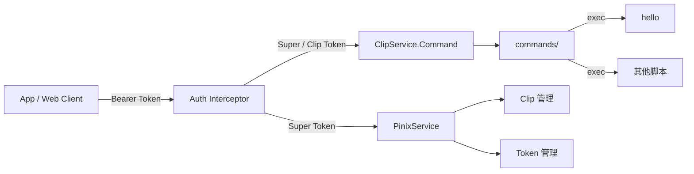

# AGENTS.md — Pinix

Pinix 是基于 Connect-RPC 的 Go 服务，通过 ClipService.Command 将 `commands/` 目录下的可执行文件暴露为 RPC，并通过 Token 鉴权控制访问。

---

## 架构



**数据流**：客户端发送 `Authorization: Bearer <token>` + `CommandRequest(name, args, stdin)` → Auth Interceptor 验证 Token → ClipService 在对应 `commands/` 目录查找同名可执行文件 → `exec` 执行 → 返回 `stdout, stderr, exit_code`。

---

## 鉴权模型

### Token 类型

| 类型 | clip_id | 权限范围 |
|------|---------|----------|
| **Super Token** | 空 | 所有接口（PinixService + ClipService） |
| **Clip Token** | 非空 | 仅 ClipService/Command，workdir 限定为 Clip 的 workdir |

### 鉴权流程

1. 从 `Authorization: Bearer <token>` 提取 Token
2. 查询 `~/.config/pinix/config.yaml` 中的 tokens 列表
3. 无 Token / 无效 Token → `CodeUnauthenticated`
4. Clip Token 调用 PinixService → `CodePermissionDenied`
5. Clip Token 调用 Command → workdir jail 到 `{clip.workdir}/commands/`
6. Super Token → 全部放行，Command 使用默认 `commands/` 目录

### 配置文件

存储路径：`~/.config/pinix/config.yaml`（权限 0600）

```yaml
clips:
  - id: "a1b2c3d4"
    name: "my-project"
    workdir: "/home/user/my-project"
tokens:
  - token: "64-char-hex-string"
    clip_id: ""        # 空 = Super Token
    label: "admin"
  - token: "64-char-hex-string"
    clip_id: "a1b2c3d4" # 绑定到特定 Clip
    label: "ci-runner"
```

---

## 文件结构

```
pinix/
├── main.go                      # 入口，注册 interceptor + 服务
├── internal/config/store.go     # Clip + Token 持久化存储（YAML + RWMutex）
├── middleware/auth.go           # Connect-RPC Bearer Token 鉴权 interceptor
├── service/
│   ├── pinix.go                 # PinixService 完整实现（CRUD Clip/Token）
│   └── clip.go                  # ClipService.Command（workdir jail + 30s 超时）
├── commands/                    # 可执行脚本目录
├── gen/                         # protoc 自动生成（不要手动编辑）
└── proto/                       # .proto 定义文件
```

---

## 开发规范

### buf generate 流程

Proto 定义在 `proto/pinix/v1/pinix.proto`，修改后执行：

```bash
buf generate
go mod tidy
```

生成代码输出到 `gen/go/`（Go）、`gen/swift/`（iOS）、`gen/ts/`（Web）。**不要手动编辑 `gen/` 下的文件。**

### SELF-DESC Header

每个 `.go` 文件顶部必须包含：

```go
// Role:    一句话描述文件职责
// Depends: 直接依赖（逗号分隔）
// Exports: 对外暴露的类型/接口
```

查询方式：

```bash
grep -r "^// Role:" *.go service/ internal/ middleware/
grep -r "Depends:.*<模块名>" *.go service/ internal/ middleware/
```

### commands/ Unix 规范

- 每个命令是独立可执行文件（shell 脚本、Go binary 等）
- 必须 `chmod +x`
- 从 stdin 读入、stdout 输出、stderr 报错
- exit code 0 = 成功，非零 = 失败
- 文件名即命令名，不含路径分隔符

---

## 可用 RPC

### PinixService（需要 Super Token）

| RPC | 说明 |
|-----|------|
| `CreateClip` | 创建 Clip（name + workdir），返回生成的 clip_id |
| `ListClips` | 列出所有 Clip |
| `DeleteClip` | 按 clip_id 删除 Clip |
| `GenerateToken` | 生成 Token（clip_id 为空 = Super Token），返回 64 字符 hex |
| `RevokeToken` | 按 token 值撤销 Token |

### ClipService（Super Token 或 Clip Token）

| RPC | 说明 |
|-----|------|
| `Command` | 执行 `commands/` 下的可执行文件（30s 超时，stderr 限 100KB） |

---

## 本地开发

### 启动

```bash
go run .
# 默认监听 :8080，可通过 PORT 环境变量覆盖
PORT=9090 go run .
```

### 初始化 Bootstrap Token

首次使用需手动写入一个 Super Token：

```bash
mkdir -p ~/.config/pinix
cat > ~/.config/pinix/config.yaml << 'EOF'
clips: []
tokens:
  - token: "my-bootstrap-super-token"
    clip_id: ""
    label: "bootstrap"
EOF
chmod 600 ~/.config/pinix/config.yaml
```

### 测试（含 Token）

```bash
TOKEN="my-bootstrap-super-token"

# 1. 生成真正的 Super Token
curl -s -X POST http://localhost:8080/pinix.v1.PinixService/GenerateToken \
  -H "Content-Type: application/json" \
  -H "Authorization: Bearer $TOKEN" \
  -d '{"clipId":"","label":"admin"}'
# → {"token":"904571e6..."}

# 2. 创建 Clip
curl -s -X POST http://localhost:8080/pinix.v1.PinixService/CreateClip \
  -H "Content-Type: application/json" \
  -H "Authorization: Bearer $TOKEN" \
  -d '{"name":"my-project","workdir":"/home/user/my-project"}'
# → {"clipId":"1cce54c4..."}

# 3. 列出 Clips
curl -s -X POST http://localhost:8080/pinix.v1.PinixService/ListClips \
  -H "Content-Type: application/json" \
  -H "Authorization: Bearer $TOKEN" \
  -d '{}'

# 4. 生成 Clip Token
curl -s -X POST http://localhost:8080/pinix.v1.PinixService/GenerateToken \
  -H "Content-Type: application/json" \
  -H "Authorization: Bearer $TOKEN" \
  -d '{"clipId":"<CLIP_ID>","label":"ci"}'

# 5. 用 Super Token 调用 Command
curl -s -X POST http://localhost:8080/pinix.v1.ClipService/Command \
  -H "Content-Type: application/json" \
  -H "Authorization: Bearer $TOKEN" \
  -d '{"name":"hello"}'
# → {"stdout":"hello from pinix\n"}

# 6. 无 Token 被拒
curl -s -X POST http://localhost:8080/pinix.v1.ClipService/Command \
  -H "Content-Type: application/json" \
  -d '{"name":"hello"}'
# → {"code":"unauthenticated"}

# 7. Clip Token 访问 PinixService 被拒
curl -s -X POST http://localhost:8080/pinix.v1.PinixService/ListClips \
  -H "Content-Type: application/json" \
  -H "Authorization: Bearer <CLIP_TOKEN>" \
  -d '{}'
# → {"code":"permission_denied"}
```

### 添加新命令

```bash
cat > commands/my-cmd << 'EOF'
#!/bin/sh
echo "result"
EOF
chmod +x commands/my-cmd
```
