# Pinix V2 协议

> 面向 Clip 开发者和 Provider 集成者的协议参考文档。
> 核心概念定义见 [architecture.md](./architecture.md)。

## 1. 概述

Pinix V2 使用两层协议。**外部协议**是 Connect-RPC（基于 HTTP/2 + Protobuf），用于 Hub 对外的所有通信——CLI、Portal、Provider（包括 Runtime 和 Edge Clip）都通过 `HubService` RPC 与 Hub 交互。**内部协议**是 IPC v2 NDJSON（换行分隔 JSON over stdin/stdout），用于 pinixd Runtime 和它管理的本地 Bun/TS Clip 进程之间的通信。

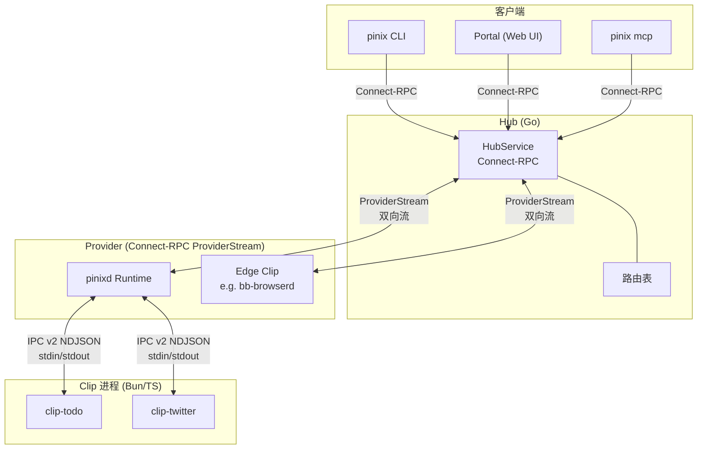

### 快速概念回顾

| 概念 | 一句话 |
|---|---|
| **Hub** | 实时路由表 + 消息转发器，只看到 Clip，不区分类型 |
| **Clip** | 功能单元，由 name + package + version 标识 |
| **Provider** | 连接协议——把 Clip 接入 Hub 的方式 |
| **Runtime (pinixd)** | 一种 Provider，额外管理 Clip 进程安装和生命周期 |
| **Edge Clip** | 开发者术语——自己实现 Provider 协议、直连 Hub 的 Clip |

## 2. 业务场景

### 2.1 Clip 启动与注册

**场景**：pinixd 启动一个本地 Clip（如 clip-todo），Clip 通过 IPC 自注册，pinixd 拿到 Manifest 后将其注册到 Hub 路由表。

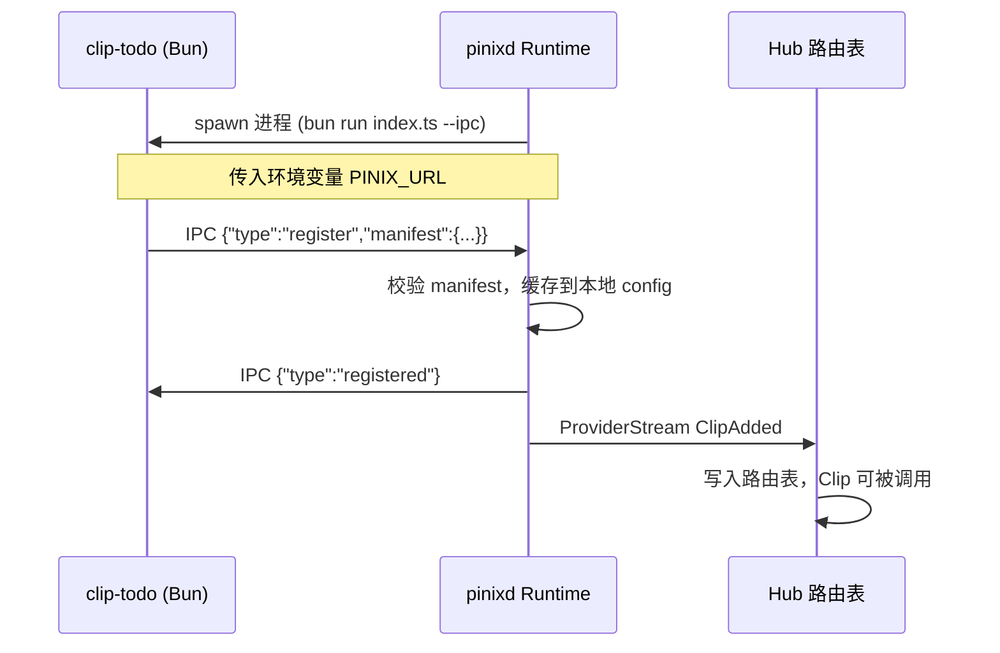

**IPC register 消息示例**：

```json
{"type":"register","manifest":{"name":"todo","package":"clip-todo","version":"0.2.0","domain":"productivity","commands":["add","list","delete"],"dependencies":[]}}
```

**关键规则**：

- Clip 启动后**必须**先发 `register`，发其他消息会被 pinixd 终止进程
- `register` 只能发**一次**，重复发送是协议错误
- Clip 不应发 `registered` 消息，pinixd 收到会终止进程
- pinixd 等待 register 超时 10 秒，超时则 kill 进程

### 2.2 命令调用（CLI -> Hub -> Clip）

**场景**：用户在终端执行 `pinix todo list`，CLI 通过 Hub 路由调用到 clip-todo 进程。

#### 2.2.1 普通调用（Unary）

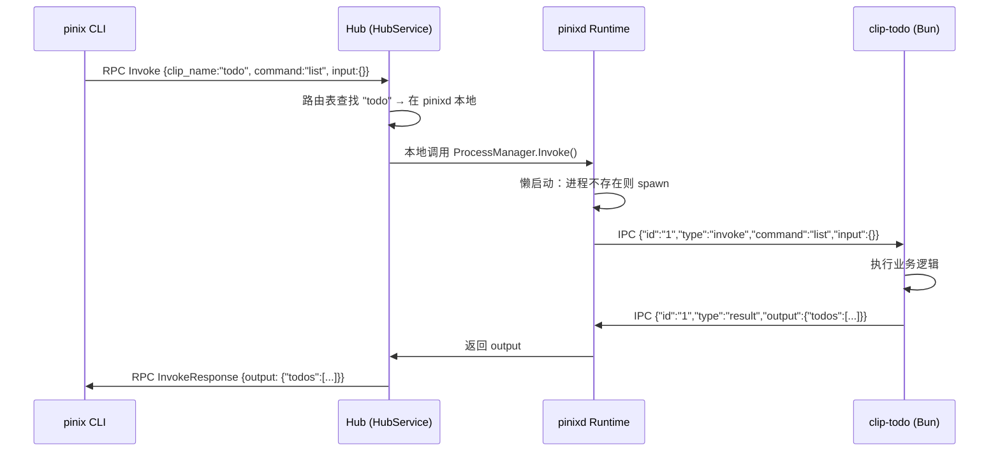

#### 2.2.2 流式调用（Server-Stream）

适用于 LLM token 流等场景。同样使用 `Invoke` RPC，但 Hub 返回多个 `InvokeResponse`。

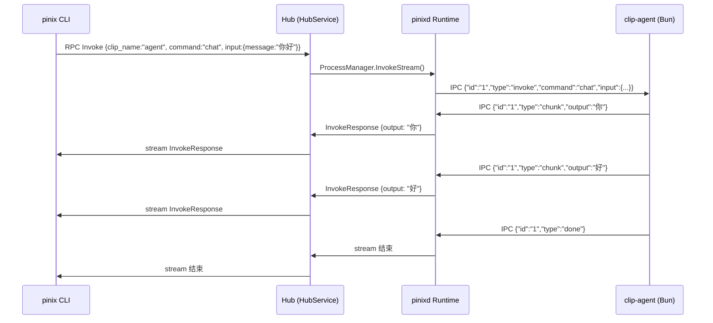

### 2.3 跨 Clip 调用（Clip A 调 Clip B，通过 Hub 路由）

**场景**：clip-twitter 在执行搜索时需要通过 bb-browser 操作浏览器。Twitter Clip 发出 IPC invoke，pinixd 路由到目标 Clip。

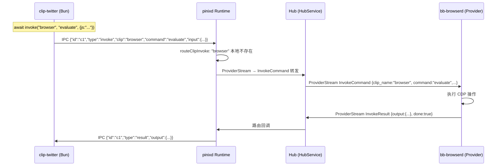

**路由优先级**：pinixd 收到 Clip 的跨 Clip invoke 后，按以下顺序查找目标：
1. 本地 Clip（同一个 pinixd 管理的进程）
2. ProviderManager 中的 Provider Clip（直连到 Hub 的 Edge Clip）
3. 通过 Hub Client 转发到外部 Hub（`pinixd --hub` 连接模式）

### 2.4 Edge Clip / Provider 接入

**场景**：bb-browserd 作为 Edge Clip Provider，启动后连入 Hub，注册 `browser` Clip，然后接收并处理 invoke 请求。

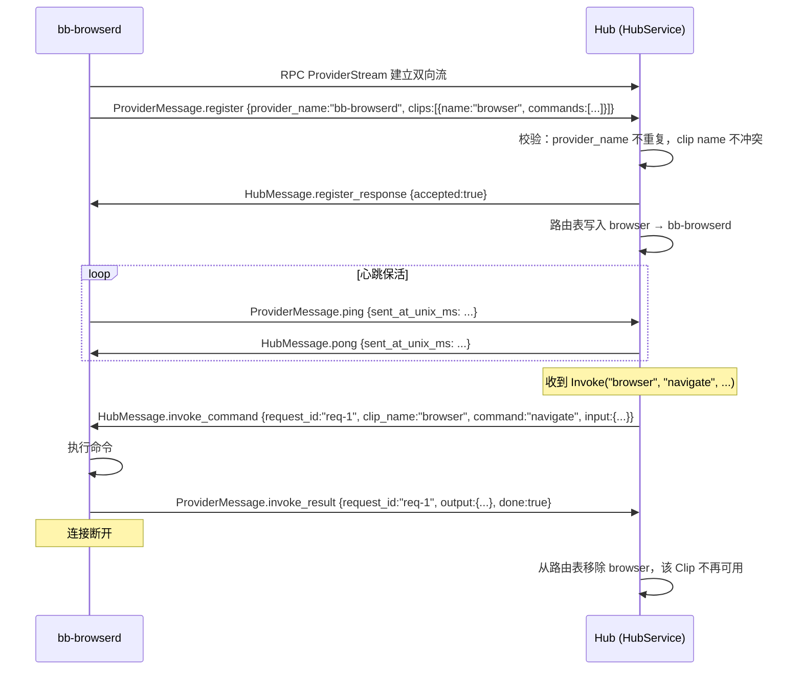

**关键规则**：

- `ProviderStream` 第一条消息**必须**是 `RegisterRequest`，否则 Hub 拒绝并返回 `accepted: false`
- `register` 只能发一次，重复发送会断开连接
- `provider_name` 在 Hub 内必须唯一，`pinixd` 和 `local` 是保留名
- Clip name 不能与 Hub 中已有 Clip 冲突
- 连接断开 → Hub 自动移除该 Provider 下所有 Clip

### 2.5 Clip 安装（pinix add）

**场景**：用户执行 `pinix add @pinixai/todo`，CLI 通过 Hub 发给 Runtime，Runtime 下载、安装、启动 Clip，然后注册到 Hub。

#### 2.5.1 本地 Runtime 安装

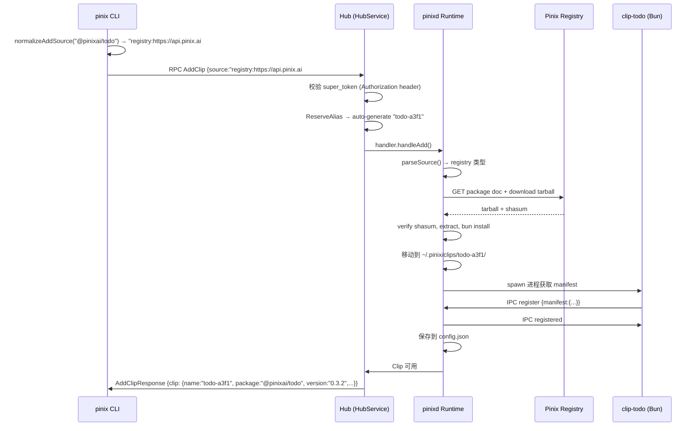

#### 2.5.2 远程 Runtime 安装（RuntimeStream）

当 Hub 没有本地 Runtime（`--hub-only`），或指定了远程 Provider：

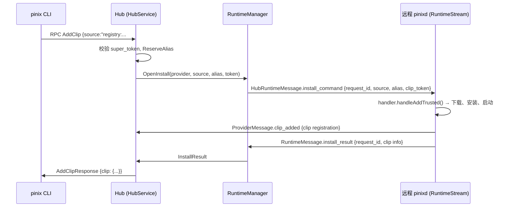

**支持的 source 格式**：

| 前缀 | CLI 输入 | 内部规范形式 | 安装方式 |
|---|---|---|---|
| `@scope/` | `@pinixai/todo` | `registry:<url>#@pinixai/todo` | 从 Pinix Registry 下载 tarball |
| `@scope/@version` | `@pinixai/todo@0.3.0` | `registry:<url>#@pinixai/todo@0.3.0` | 指定版本下载 |
| `github/` | `github/epiral/clip-todo` | `github/epiral/clip-todo` | `git clone` + `bun install` |
| `github/#branch` | `github/epiral/clip-todo#main` | `github/epiral/clip-todo#main` | 指定分支 clone |
| `local/` | `local/my-clip --path /path` | `local/my-clip:/path` | 复制目录 + `bun install` |

**Source 解析流程**：

1. CLI 收到 `@scope/name` → 解析 Registry URL → 构造 `registry:<url>#@scope/name[@version]`
2. CLI 收到 `github/...` → 直接透传
3. CLI 收到 `local/...` → 拼接 `--path` 参数 → `local/name:/abs/path`
4. Hub `AddClip` 收到 source → `parseSource()` 解析 → `installClip()` 按类型分派

### 2.6 Clip 卸载（pinix remove）

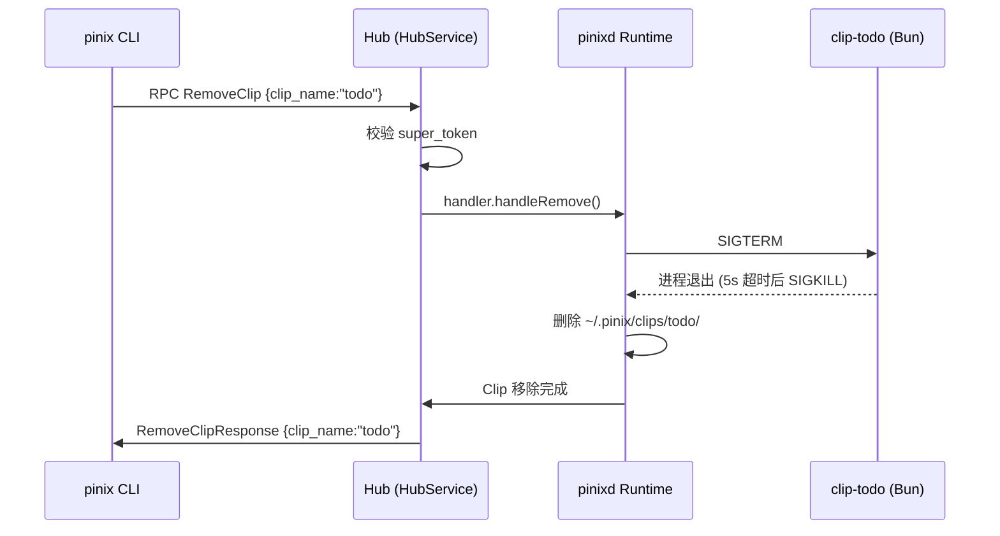

### 2.7 Portal Web UI 访问 Clip

**场景**：用户在浏览器打开 Portal，查看 Clip 列表并打开 clip-todo 的自定义 Web UI。

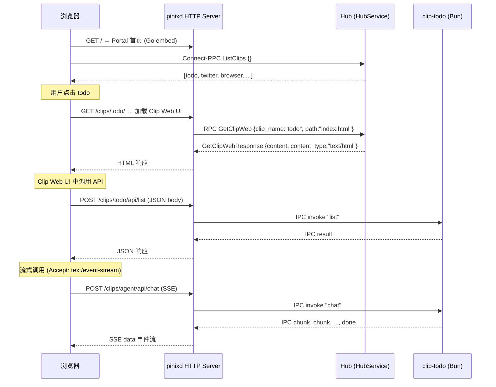

**Clip Web UI 路由规则**：

| 路径 | 方法 | 作用 |
|---|---|---|
| `/clips/{name}/` | GET | 加载 Clip 的 `web/index.html` |
| `/clips/{name}/{file}` | GET | 加载 Clip 的 `web/{file}` 静态资源 |
| `/clips/{name}/api/{command}` | POST | 调用 Clip 命令（JSON body → JSON 响应） |

## 3. Connect-RPC 协议参考

Proto 定义文件：`proto/pinix/v2/hub.proto`

### 3.1 HubService RPC 方法

| RPC | 类型 | 作用 | 认证 |
|---|---|---|---|
| `ProviderStream` | bidi-stream | Provider / Edge Clip 接入 Hub | Hub Token |
| `RuntimeStream` | bidi-stream | Runtime 接入 Hub（接受 install/remove 命令） | Hub Token |
| `ListClips` | unary | 列出当前可用 Clip | Hub Token |
| `ListProviders` | unary | 列出当前在线 Provider | Hub Token |
| `GetManifest` | unary | 获取指定 Clip 的完整 Manifest | Hub Token |
| `GetClipWeb` | unary | 读取 Clip 的 Web 静态资源 | Hub Token |
| `Invoke` | server-stream | 调用 Clip 命令（普通 + 流式） | Hub Token + Clip Token |
| `InvokeStream` | bidi-stream | 双向流调用（音频流、实时会话） | Hub Token + Clip Token |
| `AddClip` | unary | 安装并注册 Clip | Super Token |
| `RemoveClip` | unary | 卸载并移除 Clip | Super Token |
| `GetBindings` | unary | 获取 Clip 的 slot 绑定 | Hub Token |
| `SetBinding` | unary | 设置 Clip 的 slot 绑定 | Hub Token |
| `RemoveBinding` | unary | 移除 Clip 的 slot 绑定 | Hub Token |

### 3.2 认证模型

| Token | 传递方式 | 谁校验 | Hub 行为 |
|---|---|---|---|
| Hub Token | `Authorization: Bearer <token>` header | Hub middleware | 自己校验 |
| Clip Token | `InvokeRequest.clip_token` 字段 | Provider / Clip 自行校验 | 纯透传 |
| Super Token | `Authorization: Bearer <token>` header | Hub (AddClip/RemoveClip) | 自己校验 |

### 3.3 ProviderStream 消息

#### Provider -> Hub (`ProviderMessage`)

| 消息 | 用途 | 关键字段 |
|---|---|---|
| `RegisterRequest` | 首次注册，携带所有 Clip | `provider_name`, `clips[]` |
| `ClipAdded` | 运行中新增 Clip | `clip` (ClipRegistration), `request_id` |
| `ClipRemoved` | 运行中移除 Clip | `name`, `request_id` |
| `InvokeResult` | 返回调用结果 | `request_id`, `output`, `error`, `done` |
| `Heartbeat` (ping) | 心跳探测 | `sent_at_unix_ms` |
| `GetClipWebResult` | Web 文件内容返回 | `request_id`, `content`, `content_type`, `etag` |
| `ClipStatusChanged` | Clip 进程状态变更 | `name`, `status`, `message` |

#### Hub -> Provider (`HubMessage`)

| 消息 | 用途 | 关键字段 |
|---|---|---|
| `RegisterResponse` | 注册成功/失败 | `accepted`, `message` |
| `InvokeCommand` | Hub 转发调用请求 | `request_id`, `clip_name`, `command`, `input`, `clip_token` |
| `InvokeInput` | 双向流后续输入 | `request_id`, `data`, `done` |
| `Heartbeat` (pong) | 心跳回复 | `sent_at_unix_ms` |
| `GetClipWebCommand` | 请求读取 Web 文件 | `request_id`, `clip_name`, `path`, `offset`, `length`, `if_none_match` |

### 3.4 Invoke 三种模式

| 模式 | RPC | 场景示例 | 响应方式 |
|---|---|---|---|
| 简单调用 | `Invoke` | `todo.list` | 1 个 InvokeResponse |
| 流式输出 | `Invoke` | `agent.chat` (LLM token 流) | N 个 InvokeResponse |
| 双向流 | `InvokeStream` | `voice.talk` (音频流) | 流入 InputChunk + 流出 InvokeResponse |

### 3.5 关键 Protobuf 类型

```protobuf
message ClipRegistration {
  string alias = 1;             // 实例别名，Hub 内唯一
  string package = 2;           // 包名（如 @pinixai/todo）
  string version = 3;           // 版本号
  string domain = 4;            // 功能领域
  repeated CommandInfo commands = 5;
  bool has_web = 6;             // 是否有 web/ 目录
  repeated string dependencies = 7;
  bool token_protected = 8;     // 是否需要 Clip Token
  repeated string patterns = 10;       // 推荐调用模式
  map<string, string> entities = 11;   // 实体 JSON Schema
}

message ClipInfo {
  string name = 1;              // alias
  string package = 2;           // 包名（如 @pinixai/todo）
  string version = 3;
  string provider = 4;          // 所属 Provider 名
  string domain = 5;
  repeated CommandInfo commands = 6;
  bool has_web = 7;
  bool token_protected = 8;
  repeated string dependencies = 9;
  ClipStatus status = 10;       // RUNNING / SLEEPING / ERROR
  string status_message = 11;
}
```

### 3.6 RuntimeStream 消息

`RuntimeStream` 是 Hub 与远程 Runtime 之间的管理协议，用于远程安装/卸载 Clip。

#### Runtime -> Hub (`RuntimeMessage`)

| 消息 | 用途 | 关键字段 |
|---|---|---|
| `RuntimeRegister` | 首次注册 Runtime 信息 | `name`, `hostname`, `os`, `arch`, `supported_runtimes` |
| `InstallResult` | 安装操作完成 | `request_id`, `error`, `clip` (ClipInfo) |
| `RemoveResult` | 卸载操作完成 | `request_id`, `error` |
| `Heartbeat` (ping) | 心跳探测 | `sent_at_unix_ms` |

#### Hub -> Runtime (`HubRuntimeMessage`)

| 消息 | 用途 | 关键字段 |
|---|---|---|
| `RuntimeRegisterResponse` | 注册成功/失败 | `accepted`, `message` |
| `InstallCommand` | Hub 下发安装命令 | `request_id`, `source`, `alias`, `clip_token` |
| `RemoveCommand` | Hub 下发卸载命令 | `request_id`, `alias` |
| `Heartbeat` (pong) | 心跳回复 | `sent_at_unix_ms` |

#### InstallCommand / InstallResult 流程

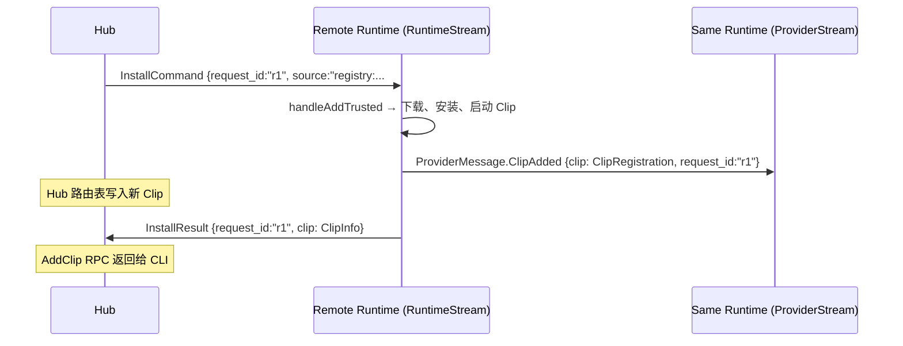

注意：远程 Runtime 同时维护两条流（`ProviderStream` 和 `RuntimeStream`），安装完成后需要通过 `ProviderStream` 发送 `ClipAdded` 使 Hub 路由表生效，同时通过 `RuntimeStream` 发送 `InstallResult` 通知 Hub 安装操作完成。

## 4. IPC v2 NDJSON 协议参考

pinixd 和本地 Bun/TS Clip 进程之间的通信协议。每条消息是一行 JSON + 换行符。

**传输层**：stdin（pinixd -> Clip）/ stdout（Clip -> pinixd），`console.log` 被 @pinixai/core 重定向到 stderr。

### 4.1 消息类型表

| type | 方向 | 必要字段 | 说明 |
|---|---|---|---|
| `register` | Clip -> pinixd | `type`, `manifest` | Clip 启动后自注册（必须是第一条） |
| `registered` | pinixd -> Clip | `type` | 注册确认（只有 pinixd 发） |
| `invoke` | 双向 | `id`, `type`, `command` 或 `clip`+`command` | 调用命令 |
| `result` | 响应方 -> 调用方 | `id`, `type`, `output` | 单次结果 |
| `error` | 响应方 -> 调用方 | `id`, `type`, `error` | 错误 |
| `chunk` | 响应方 -> 调用方 | `id`, `type`, `output` | 流式输出块 |
| `done` | 响应方 -> 调用方 | `id`, `type` | 流式输出结束 |

### 4.2 各消息详解

#### register

```json
{
  "type": "register",
  "manifest": {
    "name": "todo",
    "package": "clip-todo",
    "version": "0.2.0",
    "domain": "productivity",
    "description": "待办管理",
    "commands": ["add", "list", "delete"],
    "dependencies": []
  }
}
```

| manifest 字段 | 类型 | 必填 | 说明 |
|---|---|---|---|
| `name` | string | 是 | Clip 实例名 |
| `package` | string | 否 | npm 包名 |
| `version` | string | 否 | 版本号 |
| `domain` | string | 是 | 功能领域 |
| `description` | string | 否 | 描述 |
| `commands` | string[] 或 object[] | 是 | 支持的命令列表 |
| `dependencies` | string[] | 否 | 依赖的其他 Clip |

`commands` 支持三种格式：`["list","add"]`、`[{"name":"list"},{"name":"add"}]`、`{"list":{},"add":{}}`。pinixd 会统一解析。

#### registered

```json
{"type":"registered"}
```

仅由 pinixd 发送。Clip 收到后知道注册成功，可以开始处理 invoke。

#### invoke（调用自身命令）

```json
{"id":"1","type":"invoke","command":"list","input":{}}
```

#### invoke（调用其他 Clip）

```json
{"id":"c1","type":"invoke","clip":"browser","command":"evaluate","input":{"js":"document.title"}}
```

设置 `clip` 字段后，pinixd 会路由到目标 Clip（本地进程、Provider Clip、或通过 Hub 转发）。

#### result

```json
{"id":"1","type":"result","output":{"todos":[{"id":1,"title":"买菜","done":false}]}}
```

#### error

```json
{"id":"1","type":"error","error":"unknown command: foo"}
```

#### chunk + done（流式输出）

```json
{"id":"7","type":"chunk","output":"Hel"}
{"id":"7","type":"chunk","output":"lo "}
{"id":"7","type":"chunk","output":"World"}
{"id":"7","type":"done"}
```

Clip 使用流式输出时，通过 `@pinixai/core` 的 `stream.chunk()` 发送 chunk，函数返回后框架自动发 `done`。

### 4.3 请求 ID 规则

- pinixd -> Clip 的 invoke：ID 是递增数字字符串（`"1"`, `"2"`, ...）
- Clip -> pinixd 的跨 Clip invoke：ID 由 Clip 生成，@pinixai/core 使用 `"c1"`, `"c2"`, ... 格式
- 响应（result/error/chunk/done）的 ID 必须与请求 invoke 的 ID 一致
- 支持并发调用：多个 invoke 通过不同 ID 区分

### 4.4 完整链路示例

以 `pinix twitter search --query "AI agent"` 为例：

```
用户终端
  └→ pinix CLI
      └→ Connect-RPC Invoke {clip_name:"twitter", command:"search"}
          └→ Hub 路由表查找 "twitter" → pinixd 本地
              └→ pinixd ProcessManager
                  └→ IPC: {"id":"1","type":"invoke","command":"search","input":{...}}
                      └→ clip-twitter Bun 进程
                          └→ await invoke("browser", "evaluate", {js:"..."})
                              └→ IPC: {"id":"c1","type":"invoke","clip":"browser",...}
                                  └→ pinixd routeClipInvoke → bb-browserd
                                      └→ ProviderStream InvokeCommand → Chrome CDP
                                      └→ ProviderStream InvokeResult ←
                              └→ IPC: {"id":"c1","type":"result",...} ←
                      └→ IPC: {"id":"1","type":"result","output":[...]} ←
          └→ Connect-RPC InvokeResponse ←
      └→ 输出结果 ←
```

## 5. pinixd 运行模式

| 模式 | 命令 | Hub | Runtime | 协议角色 |
|---|---|---|---|---|
| 独立模式 | `pinixd` | 内嵌 | 内嵌 | Hub + Provider（合体） |
| 纯 Hub | `pinixd --hub-only` | 内嵌 | 无 | 纯 Hub，只接受外部 Provider |
| 连接模式 | `pinixd --hub http://...` | 连外部 | 内嵌 | 作为 Provider 连入外部 Hub |

**连接模式时序**：

Runtime 同时建立两条流连入 Hub：

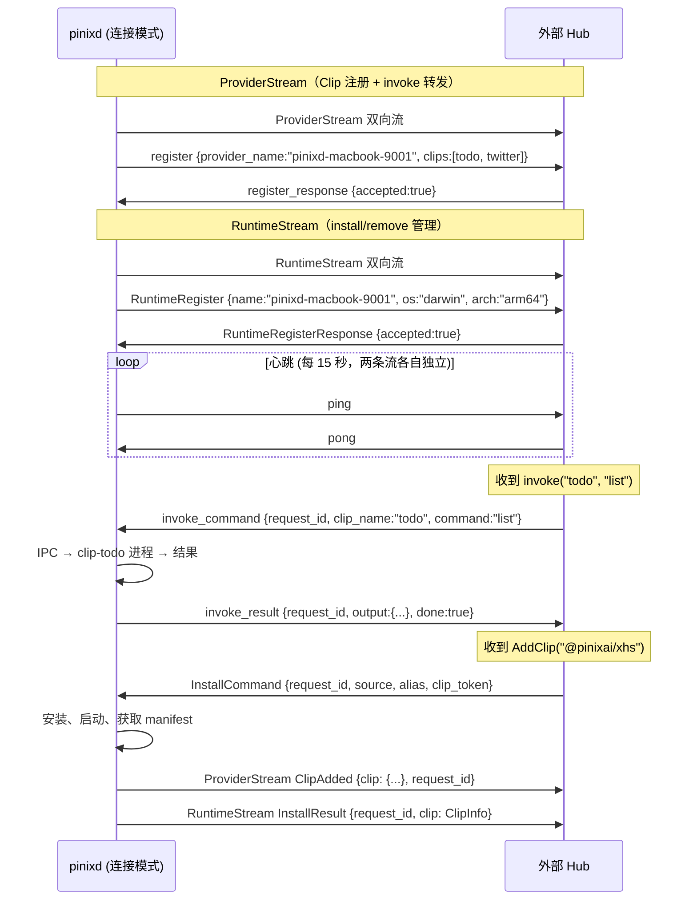

## 6. 错误处理

### Connect-RPC 层

| 错误码 | 触发场景 |
|---|---|
| `InvalidArgument` | 参数缺失或非法 |
| `NotFound` | Clip 不存在、命令不存在 |
| `PermissionDenied` | Super Token / Clip Token 校验失败 |
| `AlreadyExists` | Provider 名重复、Clip 名重复 |
| `FailedPrecondition` | Runtime 未配置、ProviderManager 未就绪 |
| `Unavailable` | Provider 连接已断开 |

### IPC 层

Clip 应用层错误通过 `error` 消息返回，不会中断进程。协议级错误（如 `register` 之前发其他消息、重复发 `register`）会导致 pinixd 终止 Clip 进程。
